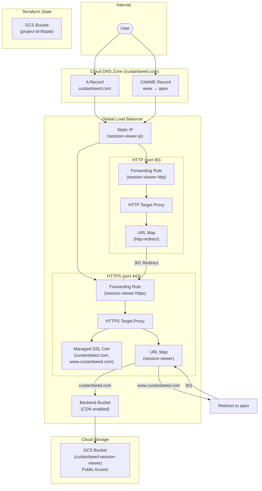

# Infrastructure

Terraform configuration for deploying session-viewer to GCP.

## Architecture



### Traffic Flow

1. **DNS Resolution**: Users access `custardseed.com` or `www.custardseed.com`, which resolves to the static IP via A record or CNAME
2. **HTTP → HTTPS**: Any HTTP traffic on port 80 is automatically redirected to HTTPS
3. **www → apex**: Requests to `www.custardseed.com` are redirected to `custardseed.com`
4. **CDN + Origin**: The backend bucket serves content from GCS with CDN caching enabled

## Resources

- **Cloud DNS** - Zone for custardseed.com
- **GCS Bucket** - Static site hosting for session-viewer
- **Load Balancer** - Global HTTPS with CDN
- **SSL Certificate** - Google-managed cert for custardseed.com and www

## Usage

```bash
# Run Terraform (uses Docker wrapper, no local install needed)
./bin/dterraform plan
./bin/dterraform apply
