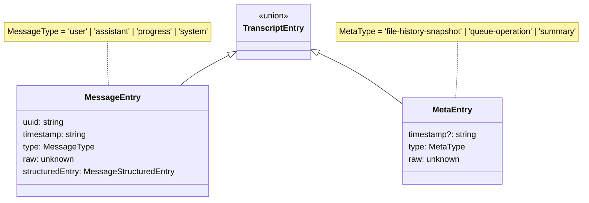
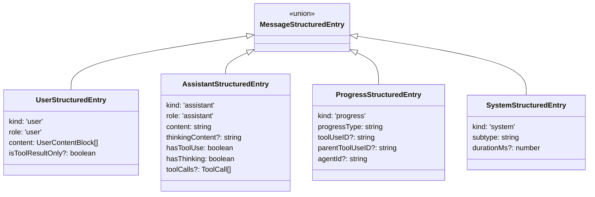
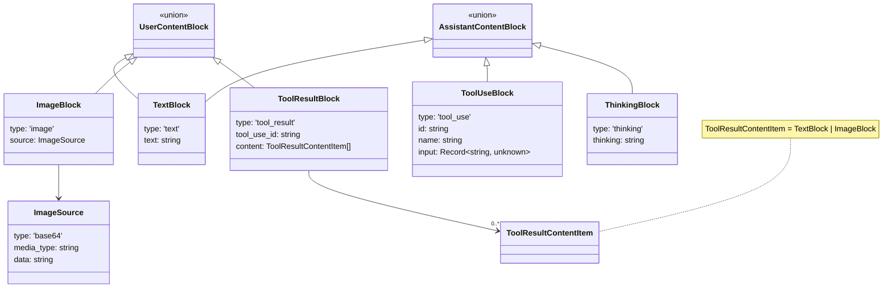
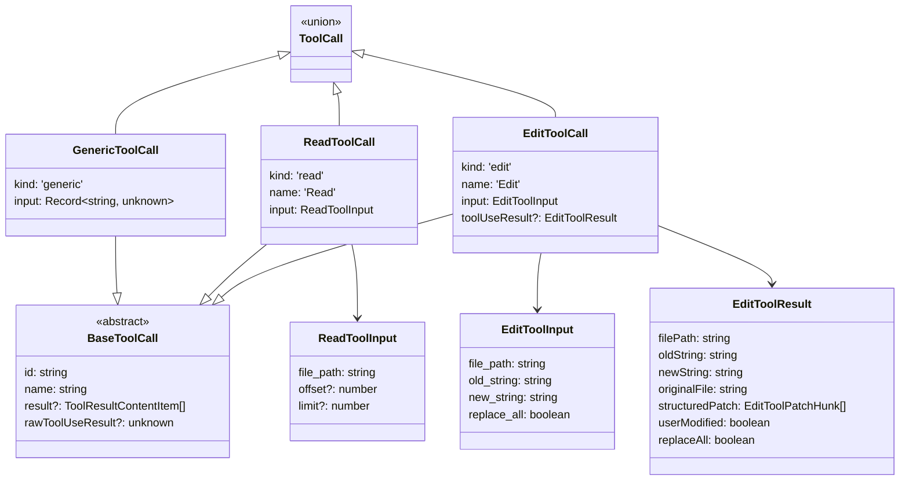

# Transcript Parsing Pipeline

## Purpose

The transcript parsing pipeline transforms raw Claude Code session transcripts (stored as JSONL files) into structured domain entities suitable for rendering. It handles validation, normalization, and correlation of data that arrives in a format optimized for append-only logging rather than display.

## Overall Shape

The pipeline is a single-pass parser with deferred correlation. Raw JSONL content is split into lines, each line is parsed as JSON and validated against Zod schemas, then transformed into domain entities. Tool calls declared in assistant messages are registered in a map, and when subsequent user messages contain tool results, those results are correlated back to their originating tool calls by ID. The output is an array of `TranscriptEntry` objects ready for consumption.

## Design Principles

The first phase of the pipeline uses Zod schemas to safely parse JSON into type-safe typescript objects. This phase must not perform any transformation or normalization of the JSON; it just performs type-safe parsing of JSON to TS objects.

The second phase transforms those zod objects into a domain representation which is easy for the rest of the application to work with. It's an anti-corruption layer that decouples Claude Code's serialization form from our application's domain model. This second phase performs transformations, mappings, and normalization as needed.

## Domain Model

### Entry Type Hierarchy

The top-level domain type is `TranscriptEntry`, a discriminated union of message entries (conversation content) and meta entries (bookkeeping data).



### Structured Entry Variants

Each `MessageEntry` contains a `structuredEntry` field—a discriminated union on the `kind` field that provides type-safe access to parsed content.



### Content Block Types

User and assistant messages contain content blocks—the atomic units of message content.



### Tool Call Model

Tool calls are extracted from assistant messages and enriched with results from subsequent user messages. The `ToolCall` type is a discriminated union supporting specialized handling for known tools.



## JSONL Structure

Each line in a Claude Code transcript JSONL file is a complete JSON object. The `type` field discriminates between entry types.

### Message Entry Types

**User message:**
```json
{
  "uuid": "abc-123",
  "parentUuid": "xyz-789",
  "type": "user",
  "timestamp": "2024-01-15T10:30:00Z",
  "sessionId": "session-456",
  "message": {
    "role": "user",
    "content": "What files are in this directory?"
  }
}
```

The `content` field can be a string (simple text) or an array of content blocks (when tool results or images are present):

```json
{
  "message": {
    "role": "user",
    "content": [
      { "type": "text", "text": "Here's what I found:" },
      {
        "type": "tool_result",
        "tool_use_id": "tool-789",
        "content": [{ "type": "text", "text": "file1.ts\nfile2.ts" }]
      }
    ]
  }
}
```

**Assistant message:**
```json
{
  "uuid": "def-456",
  "parentUuid": "abc-123",
  "type": "assistant",
  "timestamp": "2024-01-15T10:30:05Z",
  "message": {
    "role": "assistant",
    "content": [
      { "type": "text", "text": "I'll read the directory for you." },
      {
        "type": "tool_use",
        "id": "tool-789",
        "name": "Bash",
        "input": { "command": "ls" }
      }
    ]
  }
}
```

**Progress entry:**
```json
{
  "uuid": "ghi-789",
  "type": "progress",
  "timestamp": "2024-01-15T10:30:06Z",
  "data": { "type": "tool_running" },
  "toolUseID": "tool-789"
}
```

**System entry:**
```json
{
  "uuid": "jkl-012",
  "type": "system",
  "timestamp": "2024-01-15T10:30:10Z",
  "subtype": "init",
  "durationMs": 1500
}
```

### Meta Entry Types

Meta entries lack a `uuid` and represent internal state rather than conversation content:

```json
{ "type": "summary", "timestamp": "2024-01-15T10:30:00Z", "summary": "..." }
{ "type": "file-history-snapshot", "files": [...] }
{ "type": "queue-operation", "operation": "enqueue", "data": {...} }
```

## Translation Subtleties

### 1. Tool Call / Tool Result Correlation

Tool calls and their results are stored in separate JSONL entries. An assistant message declares the tool call:

```json
{ "type": "assistant", "message": { "content": [{ "type": "tool_use", "id": "abc", ... }] } }
```

A subsequent user message contains the result:

```json
{ "type": "user", "message": { "content": [{ "type": "tool_result", "tool_use_id": "abc", ... }] } }
```

The parser maintains a `Map<string, ToolCall>` during parsing. When an assistant message is processed, its tool calls are registered in this map. When a user message with tool results is processed, results are matched to their calls by ID and attached via mutation:

```typescript
toolCall.result = toolResult.content
```

This correlation happens during parsing, not after, so the final domain model has tool calls already paired with their results.

### 2. User Content Normalization

User message content can arrive as either a string or an array of blocks:

```json
{ "content": "Just text" }
{ "content": [{ "type": "text", "text": "Text" }, { "type": "tool_result", ... }] }
```

The parser normalizes both forms to `UserContentBlock[]`. A raw string becomes a single-element array containing one `TextBlock`.

### 3. Tool Result Content Normalization

Tool result content can also be string or array:

```json
{ "type": "tool_result", "content": "Raw output" }
{ "type": "tool_result", "content": [{ "type": "text", "text": "Raw output" }] }
```

The parser normalizes to the array form, converting string content to `[{ type: 'text', text: content }]`.

### 4. Assistant Content Aggregation

In the raw JSONL, assistant content is an array of blocks that may include multiple text blocks interspersed with tool uses and thinking blocks. The domain model aggregates these:

- All `text` blocks are concatenated (joined with `\n`) into a single `content: string`
- All `thinking` blocks are concatenated into `thinkingContent?: string`
- `tool_use` blocks are extracted into a separate `toolCalls` array

This simplifies rendering: consumers receive pre-aggregated text rather than needing to filter and join blocks themselves.

### 5. Tool-Result-Only User Messages

Some user messages contain only tool results with no human-authored text. These represent the system returning tool output, not actual user input. The parser detects this condition:

```typescript
const isToolResultOnly = textBlocks.length === 0 && toolResults.length > 0
```

This flag enables downstream code to filter out these "synthetic" user messages from the conversation view while still processing their tool results for correlation.

### 6. Edit Tool Result Enrichment

Edit tool calls receive special treatment. Beyond the standard `result` correlation, the parser also extracts and validates `toolUseResult` data—a structured representation of the edit including diff hunks:

```typescript
if (toolCall.kind === 'edit') {
  const validationResult = EditToolResultSchema.safeParse(toolUseResult.data)
  if (validationResult.success) {
    toolCall.toolUseResult = validationResult.data
  }
}
```

This parsed structure powers diff rendering. If validation fails, the raw data is still preserved in `rawToolUseResult` as a fallback.

### 7. Graceful Degradation for Known Tools

When parsing tool calls for known tools (Read, Edit), the parser validates inputs against expected schemas. If validation fails, rather than throwing, it logs a warning and falls back to `GenericToolCall`:

```typescript
if (block.name === 'Read') {
  const result = ReadToolInputSchema.safeParse(block.input)
  if (result.success) {
    return { kind: 'read', ... }
  }
  console.warn(`Read tool call has invalid input...`)
}
return { kind: 'generic', ... }
```

This ensures transcripts with malformed tool inputs still render, albeit without specialized formatting.

### 8. Mutable Correlation vs. Immutable Domain

The correlation mechanism mutates `ToolCall` objects after they're created—an intentional pragmatic choice. Tool calls are registered when assistant messages are parsed, then mutated when results arrive in subsequent user messages. This avoids a two-pass architecture or post-processing step, keeping the parser as a clean single pass through the JSONL lines.

The tradeoff: `ToolCall` objects are shared between the assistant's `structuredEntry.toolCalls` array and the internal correlation map. This is safe because parsing is synchronous and the map is discarded after parsing completes.
